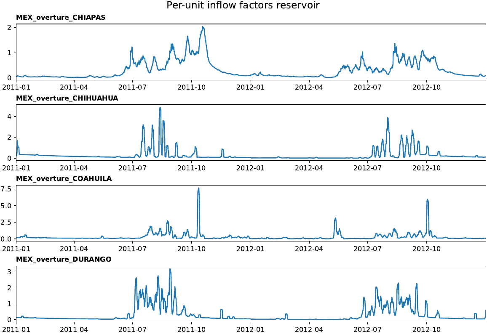
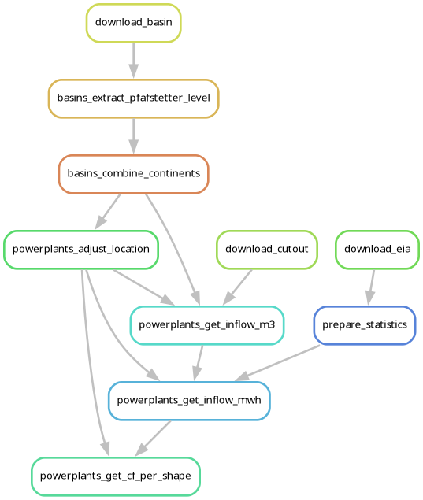
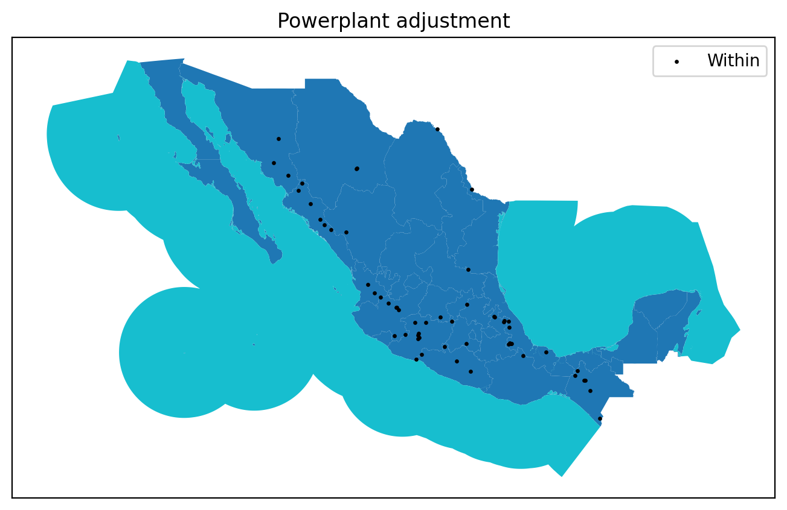

# Hydropower timeseries

A module to calculate hydropower inflow timeseries for facilities around the globe, based on Euro-Calliope methods.

<!-- Place an attractive image of module outputs here -->
<p align="center">
  
</p>

## About
<!-- Please do not modify this templated section -->

This is a modular `snakemake` workflow created as part of the [Modelblocks project](https://www.modelblocks.org/). It can be imported directly into any `snakemake` workflow.

For more information, please consult the Modelblocks [documentation](https://modelblocks.readthedocs.io/en/latest/),
the [integration example](./tests/integration/Snakefile),
and the `snakemake` [documentation](https://snakemake.readthedocs.io/en/stable/snakefiles/modularization.html).

## Overview
<!-- Please describe the processing stages of this module here -->

Data processing steps:

<p align="center">
  
</p>

1. A global dataset of hydro basins is created for a requested Pfafstetter level using data from the [HydroBASINS](https://www.hydrosheds.org/products/hydrobasins) dataset.
2. Individual powerplant locations (provided by the user) are adjusted using a buffer distance to ensure their location is within the nearest basin.

<p align="center">
  
</p>

3. User provided shapes, powerplants and configuration are used to construct a data request to the [Copernicus Data Store](https://cds.climate.copernicus.eu/) using the [`atlite` library](https://github.com/PyPSA/atlite).
4. `atlite` is used to construct inflow timeseries per powerplant.
5. Inflow timeseries are combined and aggregated to the requested resolution, using national-level statistics from the [EIA](https://www.eia.gov/international/) as a guiding normalisation heuristic for total generation.
6. Per-unit inflow timeseries ($PU_{t,r}$) are produced for each region with available capacity.
The relation is $InflowMWh_{t,r} = PU_{t,r} \cdot Cap_{r}$, where $Cap_r$ is the capacity per region.
    - For run of river powerplants, the timeseries are capped so they may not exceed available capacity.
    - For reservoirs, the timeseries are capped so inflow cannot exceed 10 times the available capacity.

<p align="center">
  
</p>

> [!CAUTION]
> Please be aware of the following limitations.
>
> The module assumes the shapes and powerplants provided by the user correspond to national totals, meaning that (for now) the module **will not adequately process subnational cases unless they are a subset of the total national scope**.
>
> The module adjusts inflow timeseries using national generation totals as a way to estimate the per-region output in each year.
> This approach is a **heuristic**.

## Configuration
<!-- Please describe how to configure this module below -->

Please consult the configuration [README](./config/README.md) and the [configuration example](./config/config.yaml) for a general overview on the configuration options of this module.

## Input / output structure
<!-- Please describe input / output file placement below -->

As input, you need a file with the polygons to aggregate into (the 'shapes'), and a file specifying national hydropower plants (either RoR or reservoir). These files should follow the `pandera` schemas specified in [_schemas.py](./workflow/scripts/_schemas.py), and can be created using other Modelblocks modules.

Outputs include aggregated timeseries per hydropower plant type, disaggregated inflow timeseries (per point powerplant), and national generation statistics.

Please consult the [interface file](./INTERFACE.yaml) for more information.

## Development
<!-- Please do not modify this templated section -->

We use [`pixi`](https://pixi.sh/) as our package manager for development.
Once installed, run the following to clone this repository and install all dependencies.

```shell
git clone git@github.com:modelblocks-org/module_hydropower.git
cd module_hydropower
pixi install --all
```

Please be aware that this is a multi-environment project (see [pixi.toml](./pixi.toml) for details).
- `default`: used for development and integration testing.
Because it contains `Snakemake`, `conda` and `pytest` as dependencies it **should not be used** in `Snakemake` rules.
- `module`: contains minimal dependencies used in `Snakemake` rules.
If modified, be sure to export it to `Snakemake` so it can be recreated by module users:

```shell
# create module.yaml and conda-spec pin files in workflow/envs/
pixi run export-snakemake-env module
```


## Testing
<!-- Please do not modify this templated section -->

For testing, simply run:

```shell
pixi run test-integration
```

To test a minimal example of a workflow using this module:

```shell
pixi shell    # activate this project's environment
cd tests/integration/  # navigate to the integration example
snakemake --use-conda --cores 2  # run the workflow!
```

## References
<!-- Please provide thorough referencing below -->

This module is based on the following research and datasets:

* **Basins: HydroSHEDS.**
Lehner, B., Grill G. (2013). Global river hydrography and network routing: baseline data and new approaches to study the world’s large river systems. Hydrological Processes, 27(15): 2171–2186. <https://doi.org/10.1002/hyp.9740>
    - Please consult the [declaration statement](./workflow/internal/HydroSHEDS.txt) in this repository for further details.
* **Inflow timeseries dataset.**
Hersbach H, Bell B, Berrisford P, et al. The ERA5 global reanalysis. Q J R Meteorol Soc. 2020;146:1999–2049. <https://doi.org/10.1002/qj.3803>
* **Inflow timeseries processing.**
Hofmann et al., (2021). atlite: A Lightweight Python Package for Calculating Renewable Power Potentials and Time Series. Journal of Open Source Software, 6(62), 3294, <https://doi.org/10.21105/joss.03294>
* **Reference source code for national adjustment heuristic.**
Tröndle, T., & Pickering, B. (2021). Euro-Calliope (Version 1.2.0.dev) [Computer software]. <https://doi.org/10.5281/zenodo.3949793>
    - MIT licensed. Please consult our source code for details.
* **National hydropower generation dataset.** U.S. Energy Information Administration (Oct 2008). <https://www.eia.gov/international/overview/world>

Additionally, this module relies on the following for testing and stable integration:
* **Data stability aid.** Ruiz Manuel, I., & Pfenninger, S. (2026). Modelblocks - module hydropower (v0.1.0) [Data set]. Zenodo. <https://doi.org/10.5281/zenodo.19401947>

## Contributors ✨

Thanks goes to these wonderful people, sorted alphabetically ([emoji key](https://allcontributors.org/en/reference/emoji-key/)):

<!-- ALL-CONTRIBUTORS-LIST:START - Do not remove or modify this section -->
<!-- prettier-ignore-start -->
<!-- markdownlint-disable -->
<!-- markdownlint-restore -->
<!-- prettier-ignore-end -->
<!-- ALL-CONTRIBUTORS-LIST:END -->

This project follows the [all-contributors](https://github.com/all-contributors/all-contributors) specification. Contributions of any kind welcome!
